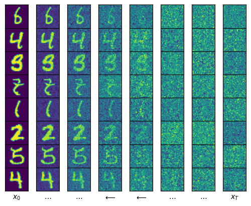

# Denoising Diffusion Probabilistic Modeling (DDPM) with PyTorch Lightning

This repository contains a minimal implementation of DDPM for MNIST digits (Ho et al., 2020) via PyTorch and PyTorch Lightning. Where possible, we reference equations from the [original paper](https://arxiv.org/abs/2006.11239)

To get started, install required packages and activate a virtual environment via
```
python -m venv .venv
source .venv/bin/activate
pip install -r requirements.txt
```

To launch training, simply run
```
python main.py
```

Note that this will download the `MNIST` dataset from `torchvision`. If you simply want to engage with the tutorial and a pretrained model, check out `demos/DDPM_Tutorial.ipynb`. 




